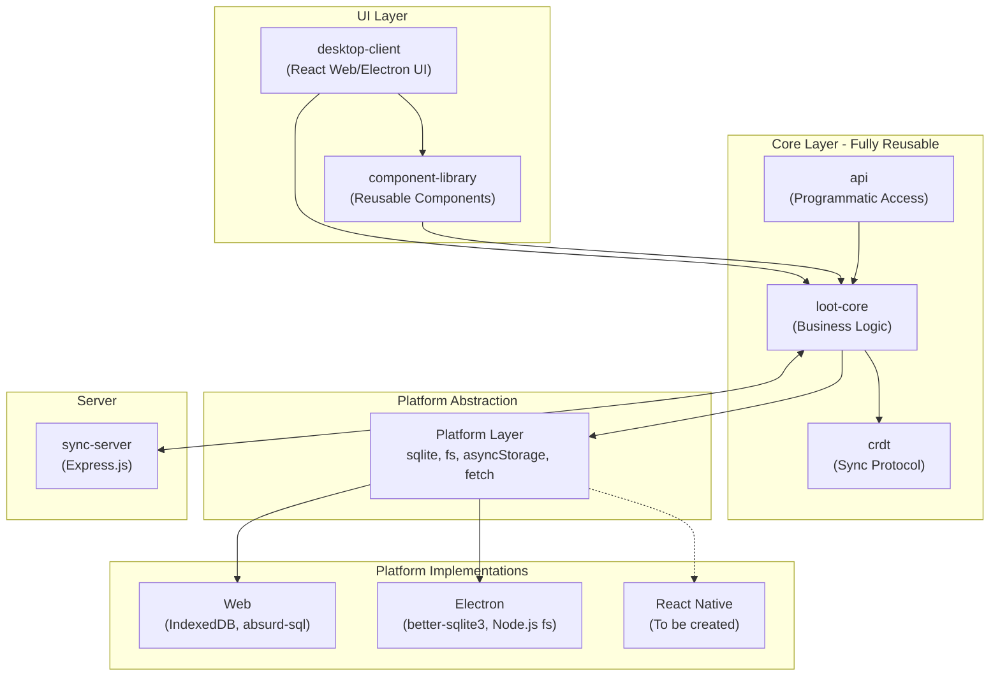
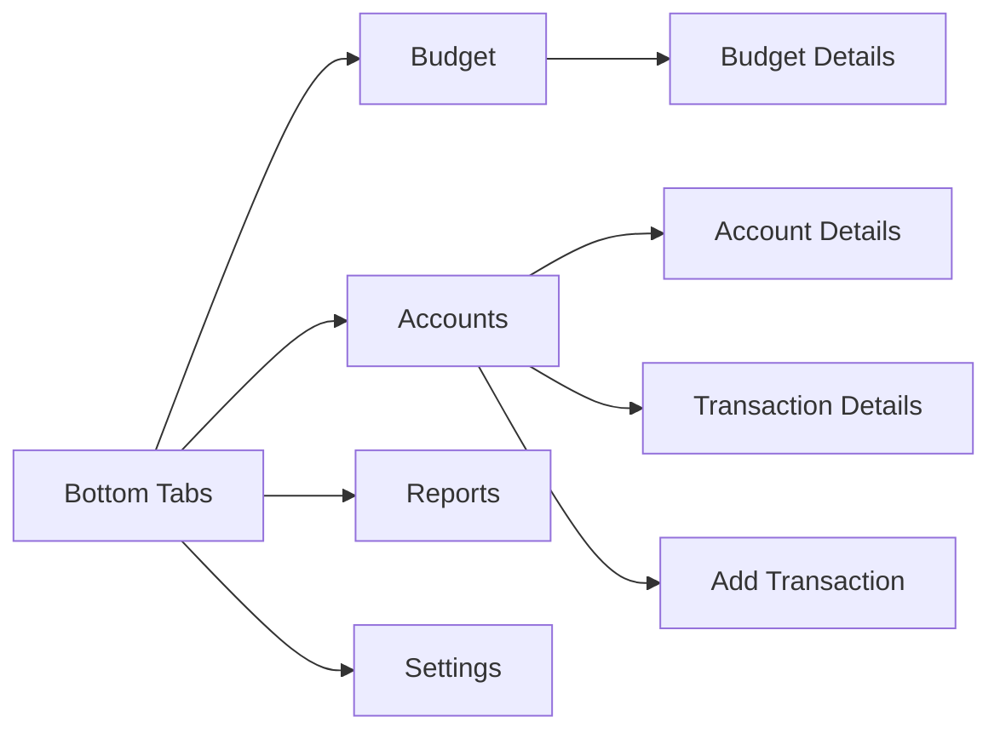
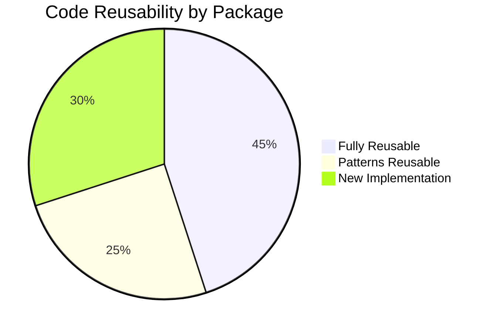

# Mobile App Development Plan for Actual Budget

This document provides a comprehensive analysis of the Actual Budget codebase to identify reusable components and create a detailed plan for developing a native mobile application.

## Project Decisions

| Decision | Choice | Rationale |
|----------|--------|-----------|
| **Target Platforms** | iOS + Android | Maximum user reach |
| **Framework** | Expo (preferred), React Native CLI (fallback) | Faster development with Expo; fallback if native modules incompatible |
| **Sync Mode** | Both offline and server sync | Match desktop app functionality - local-first with optional sync |

---

## Executive Summary

Actual Budget is architected as a local-first personal finance application with an optional sync server. The codebase is well-structured as a monorepo with clear separation between platform-agnostic core logic and platform-specific implementations. **Approximately 70-80% of the core business logic and data layer can be reused** for a mobile app, while the UI layer and platform integrations will require new implementations.

---

## Current Architecture Overview



---

## Package Analysis

### 1. Fully Reusable Packages (No Modifications Needed)

#### [`loot-core`](file:///Users/kkhirsariya/repos/test/budget-apps/actual/packages/loot-core)

The core business logic package is **platform-agnostic by design** and represents the largest reuse opportunity.

| Component | Path | Reusability |
|-----------|------|-------------|
| Business Logic | `src/server/` | ✅ 100% |
| Shared Utilities | `src/shared/` | ✅ 100% |
| Type Definitions | `src/types/` | ✅ 100% |
| Mocks | `src/mocks/` | ✅ 100% |

**Key Reusable Modules:**
- Budget calculations and management (`src/server/budget/`)
- Transaction handling (`src/server/transactions/`)
- Account management (`src/server/accounts/`)
- Rules engine (`src/server/rules/`)
- Schedules (`src/server/schedules/`)
- Reports (`src/server/reports/`)
- Data import/export (`src/server/importers/`)
- AQL query engine (`src/server/aql/`)
- Encryption (`src/server/encryption/`)
- Sync logic (`src/server/sync/`)

---

#### [`@actual-app/crdt`](file:///Users/kkhirsariya/repos/test/budget-apps/actual/packages/crdt)

The CRDT (Conflict-free Replicated Data Type) package handles data synchronization and is **100% reusable**.

| Component | Description |
|-----------|-------------|
| Merkle Trees | Efficient sync state comparison |
| Timestamps | Hybrid logical clocks |
| Protocol Buffers | Binary sync message format |
| Core Sync Logic | Conflict resolution |

---

#### [`@actual-app/api`](file:///Users/kkhirsariya/repos/test/budget-apps/actual/packages/api)

The programmatic API is **fully reusable** for mobile, providing:
- Budget file management
- Transaction CRUD operations
- Account management
- Sync operations

---

### 2. Partially Reusable Packages (Design Patterns Reusable)

#### [`component-library`](file:///Users/kkhirsariya/repos/test/budget-apps/actual/packages/component-library)

| Aspect | Reusability |
|--------|-------------|
| Component Structure | ✅ Design patterns reusable |
| Theme System | ✅ Color tokens, spacing reusable |
| Icons | ⚠️ SVGs need React Native conversion |
| Emotion CSS | ❌ Not compatible with React Native |
| React Aria | ❌ Web-specific accessibility |

**What to Reuse:**
- Theme tokens ([`theme.ts`](file:///Users/kkhirsariya/repos/test/budget-apps/actual/packages/component-library/src/theme.ts))
- Design tokens ([`tokens.ts`](file:///Users/kkhirsariya/repos/test/budget-apps/actual/packages/component-library/src/tokens.ts))
- Component API patterns (props interfaces)
- Icon designs (convert SVG to React Native SVG)

---

#### [`desktop-client`](file:///Users/kkhirsariya/repos/test/budget-apps/actual/packages/desktop-client)

| Aspect | Reusability |
|--------|-------------|
| Redux Store | ✅ Fully reusable |
| Custom Hooks | ⚠️ Some reusable (non-DOM) |
| Business Logic in Hooks | ✅ Reusable |
| React Components | ❌ Web-specific |
| Responsive Mobile Components | ❌ Web-specific (CSS-based) |

**Reusable Hooks** (from [`src/hooks/`](file:///Users/kkhirsariya/repos/test/budget-apps/actual/packages/desktop-client/src/hooks)):
- Data fetching hooks
- State management hooks
- Business logic hooks
- Query hooks

**Not Reusable:**
- DOM-based hooks (scroll listeners, resize observers)
- CSS-in-JS styling
- React Router navigation
- Web-specific gesture handling

---

### 3. Requires New Mobile Implementation

#### Platform Abstraction Layer ([`loot-core/src/platform/`](file:///Users/kkhirsariya/repos/test/budget-apps/actual/packages/loot-core/src/platform))

> [!IMPORTANT]
> The platform layer is well-designed with defined interfaces. Each subsystem needs a React Native implementation.

| Platform Module | Current Implementations | Mobile Requirement |
|-----------------|------------------------|-------------------|
| **SQLite** | `index.web.ts` (absurd-sql), `index.electron.ts` (better-sqlite3) | `index.mobile.ts` (react-native-sqlite-storage or expo-sqlite) |
| **File System** | `index.web.ts` (OPFS), `index.electron.ts` (Node.js fs) | `index.mobile.ts` (react-native-fs or expo-file-system) |
| **Async Storage** | `index.ts` (IndexedDB) | `index.mobile.ts` (@react-native-async-storage/async-storage) |
| **Fetch** | `index.browser.ts`, `index.ts` | ⚠️ May work with React Native fetch |
| **Connection** | `index.ts` | May need adaptation for mobile background handling |

---

## Recommended Technology Stack for Mobile

### Core Framework: Expo with Development Build

Based on the project requirements (iOS + Android, offline + sync support), **Expo is compatible** and recommended.

> [!NOTE]
> Expo's "development build" workflow allows native module usage while retaining Expo's developer experience. This covers all required functionality.

#### Expo Compatibility Analysis

| Requirement | Expo Support | Package |
|-------------|--------------|---------|
| SQLite | ✅ Supported | `expo-sqlite` (sync API) or `expo-sqlite/next` (async) |
| File System | ✅ Supported | `expo-file-system` |
| Async Storage | ✅ Supported (via community) | `@react-native-async-storage/async-storage` |
| Offline Mode | ✅ Native SQLite | Local database storage |
| Server Sync | ✅ HTTP/HTTPS | `fetch` API works natively |
| Both iOS & Android | ✅ Full support | Single codebase |

> [!TIP]
> If performance issues arise with `expo-sqlite`, you can eject to a development build and use `react-native-quick-sqlite` without losing other Expo benefits.

### Recommended Dependencies

| Category | Package | Notes |
|----------|---------|-------|
| **Database** | `expo-sqlite` | Primary; use JSI-based alternative if needed |
| **File System** | `expo-file-system` | Budget file import/export |
| **Async Storage** | `@react-native-async-storage/async-storage` | Preferences, tokens |
| **Navigation** | `@react-navigation/native` + `@react-navigation/bottom-tabs` | Tab-based navigation |
| **State** | `@reduxjs/toolkit`, `react-redux` | Reuse existing setup |
| **Charts** | `victory-native` or `react-native-gifted-charts` | For reports |
| **Icons** | `react-native-svg` | Convert existing SVG icons |
| **Gestures** | `react-native-gesture-handler` | Swipe actions |
| **Animations** | `react-native-reanimated` | Smooth transitions |
| **Biometrics** | `expo-local-authentication` | Face ID, Touch ID, Fingerprint |
| **Background Tasks** | `expo-background-fetch` | Background sync |
| **Secure Storage** | `expo-secure-store` | Encryption keys |

---

## Implementation Phases

### Phase 1: Foundation (4-6 weeks)

Create the mobile platform layer and basic infrastructure.

#### 1.1 Create Mobile Package Structure

```
packages/
└── mobile-app/                    # NEW
    ├── src/
    │   ├── platform/              # Mobile platform implementations
    │   │   ├── sqlite.mobile.ts
    │   │   ├── fs.mobile.ts
    │   │   └── asyncStorage.mobile.ts
    │   ├── components/            # React Native components
    │   ├── navigation/            # Navigation setup
    │   ├── screens/               # Screen components
    │   └── hooks/                 # Mobile-specific hooks
    ├── app.json
    └── package.json
```

#### 1.2 Platform Layer Implementation

> [!CAUTION]
> SQLite implementation is critical. The app's local-first nature depends on reliable database operations.

**Priority order:**
1. Async Storage (simplest, needed for preferences)
2. SQLite (core functionality, complex)
3. File System (budget file management)
4. Connection/Fetch (sync, mostly reusable)

#### 1.3 Core Integration

- Wire up `loot-core` with mobile platform implementations
- Configure Vite/Metro bundler for monorepo
- Set up Redux store with existing reducers

---

### Phase 2: Core Features (6-8 weeks)

Implement essential budgeting functionality.

| Feature | Priority | Complexity |
|---------|----------|------------|
| Budget View | P0 | High |
| Transaction List | P0 | Medium |
| Add Transaction | P0 | Medium |
| Account List | P0 | Low |
| Account Details | P1 | Medium |
| Category Management | P1 | Medium |

#### 2.1 Component Library Translation

Create React Native equivalents:

| Web Component | React Native Equivalent |
|---------------|------------------------|
| `View` | React Native `View` |
| `Text` | React Native `Text` |
| `Button` | `TouchableOpacity` + custom styling |
| `Input` | `TextInput` |
| `Menu` | Custom or `react-native-menu` |
| Table/Lists | `FlatList` / `SectionList` |

#### 2.2 Navigation Structure



---

### Phase 3: Sync & Advanced Features (4-6 weeks)

| Feature | Priority | Notes |
|---------|----------|-------|
| Server Sync | P0 | CRDT layer is reusable |
| Schedules | P1 | Business logic reusable |
| Rules | P2 | Complex, defer initially |
| Reports | P2 | Charts need React Native SVG |
| Bank Sync | P3 | Requires server integration |

---

### Phase 4: Polish & Platform Features (4-6 weeks)

| Feature | Platform |
|---------|----------|
| Push Notifications | iOS/Android |
| Biometric Lock | iOS Face/Touch ID, Android Fingerprint |
| Widget Support | iOS/Android native widgets |
| Offline Indicators | Both |
| Background Sync | Both |

---

## Code Reuse Summary



| Category | Percentage | Examples |
|----------|------------|----------|
| **Fully Reusable** | ~45% | `loot-core/src/server/*`, `loot-core/src/shared/*`, `crdt/*`, `api/*`, types |
| **Patterns Reusable** | ~25% | Component APIs, theme tokens, hooks logic, Redux setup |
| **New Implementation** | ~30% | Platform layer, UI components, navigation |

---

## Key Files to Reference

### Platform Interface Definitions

These files define the contracts that mobile implementations must fulfill:

- [`loot-core/src/platform/server/sqlite/index.ts`](file:///Users/kkhirsariya/repos/test/budget-apps/actual/packages/loot-core/src/platform/server/sqlite/index.ts) - SQLite interface
- [`loot-core/src/platform/server/fs/index.ts`](file:///Users/kkhirsariya/repos/test/budget-apps/actual/packages/loot-core/src/platform/server/fs/index.ts) - File system interface
- [`loot-core/src/platform/server/asyncStorage/index.ts`](file:///Users/kkhirsariya/repos/test/budget-apps/actual/packages/loot-core/src/platform/server/asyncStorage/index.ts) - Storage interface

### Existing Platform Implementations (Reference)

Study these to understand requirements:

- [`loot-core/src/platform/server/sqlite/index.web.ts`](file:///Users/kkhirsariya/repos/test/budget-apps/actual/packages/loot-core/src/platform/server/sqlite/index.web.ts) - Web SQLite
- [`loot-core/src/platform/server/sqlite/index.electron.ts`](file:///Users/kkhirsariya/repos/test/budget-apps/actual/packages/loot-core/src/platform/server/sqlite/index.electron.ts) - Electron SQLite
- [`loot-core/src/platform/server/fs/index.web.ts`](file:///Users/kkhirsariya/repos/test/budget-apps/actual/packages/loot-core/src/platform/server/fs/index.web.ts) - Web FS

### Core Business Logic (Reusable)

- [`loot-core/src/server/main.ts`](file:///Users/kkhirsariya/repos/test/budget-apps/actual/packages/loot-core/src/server/main.ts) - Main entry point
- [`loot-core/src/server/sync/index.ts`](file:///Users/kkhirsariya/repos/test/budget-apps/actual/packages/loot-core/src/server/sync/index.ts) - Sync logic

---

## Effort Estimation

| Phase | Duration | Team Size |
|-------|----------|-----------|
| Phase 1: Foundation | 4-6 weeks | 2 developers |
| Phase 2: Core Features | 6-8 weeks | 2-3 developers |
| Phase 3: Sync & Advanced | 4-6 weeks | 2 developers |
| Phase 4: Polish | 4-6 weeks | 2 developers |
| **Total** | **18-26 weeks** | - |

---

## Risks & Mitigations

| Risk | Impact | Mitigation |
|------|--------|------------|
| SQLite performance on mobile | High | Use `react-native-quick-sqlite` for better performance |
| Large budget file handling | Medium | Implement pagination, lazy loading |
| Background sync reliability | Medium | Use platform-specific background task APIs |
| Bundle size with shared code | Low | Tree shaking, lazy loading |

---

## Verification Strategy

### Automated Tests
- Reuse existing `loot-core` unit tests
- Add mobile-specific platform layer tests
- E2E tests with Detox or Maestro

### Manual Verification
- Test on physical iOS and Android devices
- Verify sync with existing web/desktop clients
- Test offline scenarios

---

## Next Steps

> [!IMPORTANT]
> All major decisions have been confirmed. Ready to proceed with implementation.

### Immediate Actions

1. ✅ ~~Decide framework~~ → **Expo with development build**
2. ✅ ~~Decide platforms~~ → **iOS + Android**
3. ✅ ~~Decide sync mode~~ → **Offline + optional server sync**

### Implementation Checklist

- [x] Initialize Expo project: `npx create-expo-app@latest packages/mobile-app --template blank-typescript`
- [x] Configure monorepo workspace in root `package.json`
- [x] Create mobile platform layer implementations:
  - [x] `asyncStorage.mobile.ts` (simplest, start here)
  - [x] `sqlite.mobile.ts` (critical, complex)
  - [x] `fs.mobile.ts` (budget files)
- [ ] Set up Metro bundler to resolve `loot-core`
- [ ] Integrate Redux store from existing setup
- [x] Build first screen: Account list (simplest)
- [x] Build core feature: Budget view
- [ ] Build core feature: Add transaction
- [ ] Implement sync with server
- [ ] Add biometric authentication
- [ ] Add background sync
- [ ] Beta testing on TestFlight (iOS) / Internal Testing (Android)

### Current State

The mobile app is runnable with demo data. To run:

```bash
cd packages/mobile-app
yarn start
```

Files created:
- `src/platform/` - Platform implementations (asyncStorage, SQLite, fs)
- `src/backend/` - Backend abstraction with demo mode
- `src/screens/` - Budget, Accounts, Reports, Settings screens
- `src/navigation/` - Bottom tab navigation
- `src/utils/` - Formatting utilities


